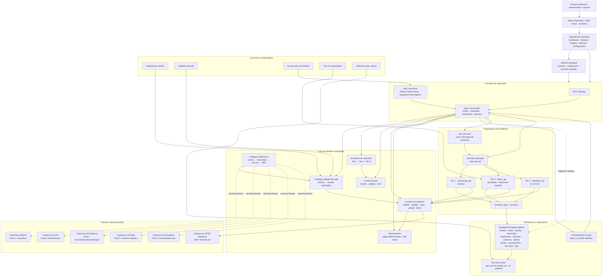

# Cleanleaf — Mapa de arquitectura y experiencia operativa

## 1. Lectura ejecutiva

Cleanleaf está organizado como un sistema por capas. La interfaz web es un consumidor; las reglas de negocio viven en contratos compartidos y procedimientos tRPC. La persistencia multi-tenant y los workflows externos están preparados como interfaces de integración, aunque Supabase, n8n, Dify y Copernicus real todavía requieren configuración de staging.

La experiencia tipo JARVIS debe entenderse como una **capa de orquestación conversacional controlada**, no como una autoridad que inventa datos. JARVIS puede explicar, priorizar, preguntar y proponer acciones. La API, el catálogo satelital, los límites de plan y los permisos siempre tienen la última palabra.

## 2. Mapa jerárquico



## 3. Jerarquía de decisiones

| Nivel | Pregunta | Componente responsable | Resultado |
| --- | --- | --- | --- |
| 1. Identidad | ¿Quién solicita y a qué tenant pertenece? | Auth, API key y RLS | `tenant_id`, rol y permisos |
| 2. Producto | ¿Qué recurso Copernicus es válido para este sector? | `copernicus-catalog.ts` y `satellite-catalog.ts` | Fuente activa o recurso futuro desactivado |
| 3. Seguridad | ¿La configuración intenta ampliar la política? | Allowlist y diagnóstico fail-safe | Fallback seguro y advertencia |
| 4. Escala | ¿Cuánta superficie se procesa? | `satellite-router.ts` | Tier 1, Tier 2 o Tier 3 |
| 5. Capacidad | ¿El plan permite el análisis? | `plan-limits.ts` | Aceptación o rechazo con código |
| 6. Operación | ¿Debe ejecutarse ahora o entrar en cola? | n8n y estado de solicitud | `en_cola`, `procesando`, `completado`, `error` |
| 7. Interpretación | ¿Cómo se explica el resultado? | interpretación determinista y Dify | Mensaje con fuente, variable, unidad y contexto |
| 8. Presentación | ¿Cómo se muestra sin fricción? | UI responsive y futura PWA | Dashboard, alerta, explicación y siguiente acción |

## 4. Estructura para ajustar workflows

Cada workflow debe tratar la API como contrato, no como una colección de consultas directas a la base de datos.

```text
Evento
  ↓
Autenticación / firma del request
  ↓
POST /api/v1/solicitudes o webhook n8n
  ↓
Validación de tenant + fuente + superficie + plan
  ↓
Estado: pendiente → en_cola → procesando
  ↓
Selección del motor por tier
  ├─ Tier 1: procesamiento corto por predio
  ├─ Tier 2: estadística agregada por zona
  └─ Tier 3: batch regional con liberación explícita
  ↓
Medición normalizada
  ↓
Informe / alerta / consumo / workflow_log
  ↓
Notificación y polling del frontend
```

Los workflows actuales son stubs seguros. Jules debe conectar autenticación, persistencia, idempotencia y reintentos antes de activarlos. Un retry nunca debe duplicar una medición o consumir dos veces las hectáreas del tenant.

## 5. Experiencia de usuario clara, precisa y flexible

La pantalla debe mantener una secuencia estable: **qué está pasando, por qué, qué fuente se usó y qué puede hacer la persona ahora**. El usuario no debería tener que conocer nombres técnicos como Statistical API para solicitar un análisis.

En móvil, la prioridad es una sola columna, acciones grandes, estados visibles y navegación por contexto. El botón “Nuevo análisis” debe abrir directamente la selección de predio o área; el tier y el tiempo estimado deben aparecer antes de confirmar. Las tarjetas de fuente deben explicar el beneficio en lenguaje de negocio, por ejemplo “vigor vegetal” o “humedad con nubosidad”, y dejar los nombres técnicos como detalle secundario.

En escritorio, el mapa, la serie temporal y el panel de explicación pueden convivir. En móvil, el mapa debe preceder al gráfico y el gráfico debe poder plegarse. Las alertas deben ser accionables y no solo informativas: cada alerta necesita severidad, causa probable, fuente, fecha y acción sugerida.

## 6. Capa tipo JARVIS

La capa conversacional propuesta se divide en cinco capacidades:

1. **Resumen:** “¿Qué cambió desde la última lectura?”
2. **Explicación:** “¿Por qué bajó el vigor?”
3. **Orientación:** “¿Qué fuente conviene si hay nubosidad?”
4. **Acción controlada:** “Crear análisis para El Aromo” con confirmación visible antes de mutar datos.
5. **Seguimiento:** “Avísame cuando termine el análisis regional” mediante el workflow autorizado.

JARVIS debe recibir un contexto estructurado, nunca leer secretos ni consultar proveedores directamente desde el cliente:

```json
{
  "tenant_id": "resuelto_por_auth",
  "rol": "admin",
  "predio": { "id": "predio-el-aromo", "hectareas": 31 },
  "sector": "agricultura",
  "fuentes_disponibles": ["sentinel-2", "sentinel-1"],
  "tier": "tier1_predio",
  "ultima_medicion": { "fuente": "sentinel-2", "variable": "ndvi", "valor": 0.51, "unidad": "ratio" },
  "alertas": ["revisar_humedad"]
}
```

Las respuestas deben incluir fuente, fecha, variable y nivel de certeza. Cuando falten datos, debe decir “no tengo suficiente información” y proponer una consulta válida. Una acción mutante debe pasar por el mismo `apiV1` que usa la interfaz; el modelo nunca debe saltarse plan-limits, RLS o allowlists.

## 7. Qué está construido y qué falta

| Estado | Componentes |
| --- | --- |
| Construido | Dashboard responsive, formulario de análisis, catálogo satelital fail-safe, catálogo Copernicus por sector, tiers, límites de plan, contratos tRPC, stubs n8n, schema/seed Supabase objetivo y pruebas de dominio |
| Preparado para integración | CDSE Statistical, CMEMS, CLMS, CEMS, CDS, CAMS, Dify, API keys, onboarding, polling y PWA |
| Pendiente crítico | Supabase real + RLS ejecutable, API HTTP `/api/v1`, persistencia de solicitudes/consumo, OAuth2 server-side CDSE, workflows autenticados, Dify real y pruebas E2E |

## 8. Principios de diseño para continuar

> **El usuario elige una necesidad; Cleanleaf traduce esa necesidad a una fuente, un tier y una acción verificable.**

> **La IA explica y coordina; el dominio valida y decide.**

> **Toda integración futura debe poder apagarse sin romper el dashboard.**

### Referencias oficiales

[1]: https://dataspace.copernicus.eu/ "Copernicus Data Space Ecosystem"
[2]: https://dataspace.copernicus.eu/data-collections/copernicus-sentinel-missions/sentinel-1 "Copernicus Sentinel-1"
[3]: https://dataspace.copernicus.eu/data-collections/copernicus-sentinel-missions/sentinel-2 "Copernicus Sentinel-2"
[4]: https://dataspace.copernicus.eu/copernicus-services "Copernicus services"
